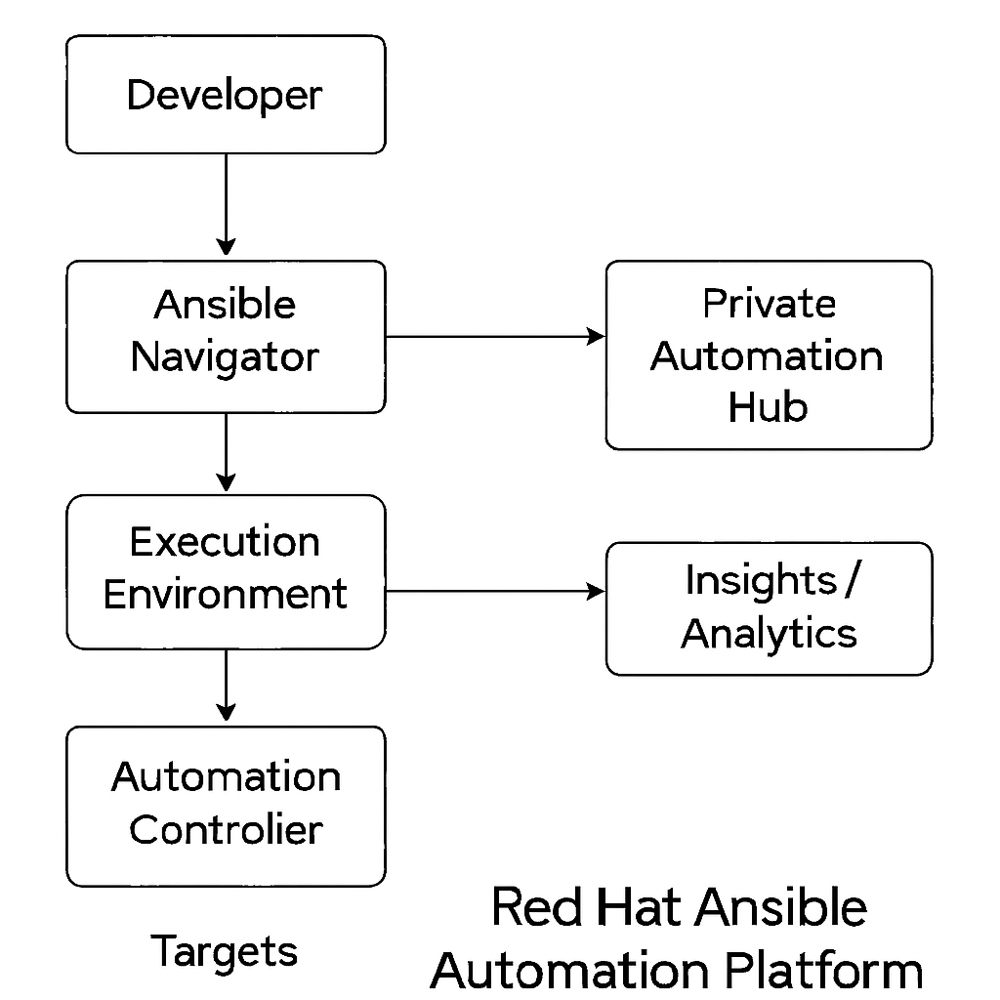

# Red Hat Ansible Automation Platform 2.2 – Architecture Overview

Red Hat Ansible Automation Platform (AAP) is an enterprise framework for building and operating IT automation at scale.

## 🧠 Core Components

### 1. **Ansible Core**
- CLI tools like `ansible`, `ansible-playbook`, `ansible-doc`
- Uses YAML-based Playbooks
- Supports conditionals, loops, blocks, etc.

### 2. **Automation Execution Environments (EE)**
- Container images that bundle:
  - Ansible Core
  - Required Collections
  - Python dependencies
- Ensures consistent automation from dev to prod
- Custom EEs can be built with `ansible-builder`

### 3. **Automation Controller** (formerly Ansible Tower)
- Central UI and API to manage automation
- Features:
  - Role-Based Access Control (RBAC)
  - Inventory & job scheduling
  - Workflow orchestration
  - Notification & logging
  - REST API for integrations

### 4. **Private Automation Hub**
- Internal registry for Ansible Collections and Execution Environments
- Enables secure sharing of curated automation content across teams

### 5. **Red Hat Insights for AAP**
- Cloud-based service to track automation usage
- Provides performance metrics and ROI visibility

---

## 🔗 Component Interaction

### UPDATE on 2.5: 
# Red Hat Ansible Automation Platform Architecture Comparison

| AAP 2.2                                           | AAP 2.5                                                 |
|--------------------------------------------------|----------------------------------------------------------|
| 👤 Developer                                     | 👤 Developer                                             |
|     |                                            |     |                                                    |
|     v                                            |     v                                                    |
| Ansible CLI / Navigator                         | Ansible CLI / Navigator                                 |
|     |                                            |     |                                                    |
|     +--> Automation Controller                  |     +--> Automation Controller                          |
|     +--> Private Automation Hub                 |     +--> Private Automation Hub                         |
|                                                 |     +--> Event-Driven Ansible                           |
|                                                 |            |                                              |
|     |                                            |            v                                              |
|     v                                            |      [Platform Gateway]                                 |
| Executes on Managed Nodes                       |  - Centralized access control                           |
|                                                 |  - Single sign-on / authentication                      |
|                                                 |  - Unified gateway for API & UI access                  |
|                                                 |            |                                              |
|                                                 |            v                                              |
|                                                 |   Red Hat Insights, Managed Nodes, etc.                 |

## What Platform Gateway Solves

### 🚫 Problem in AAP 2.2

- Each component (Controller, Hub, Event-Driven, etc.) handled its own authentication.
- No unified control plane or entry point.
- Harder to scale or integrate with external SSO systems.

### ✅ Solution in AAP 2.5 (Platform Gateway)

- Acts as a centralized access layer (like a front door).
- Handles all authentication (OIDC, SAML, LDAP) in one place.
- Makes it easier to plug AAP into enterprise IAM or analytics systems.
- Simplifies installation, monitoring, and scaling in large environments.